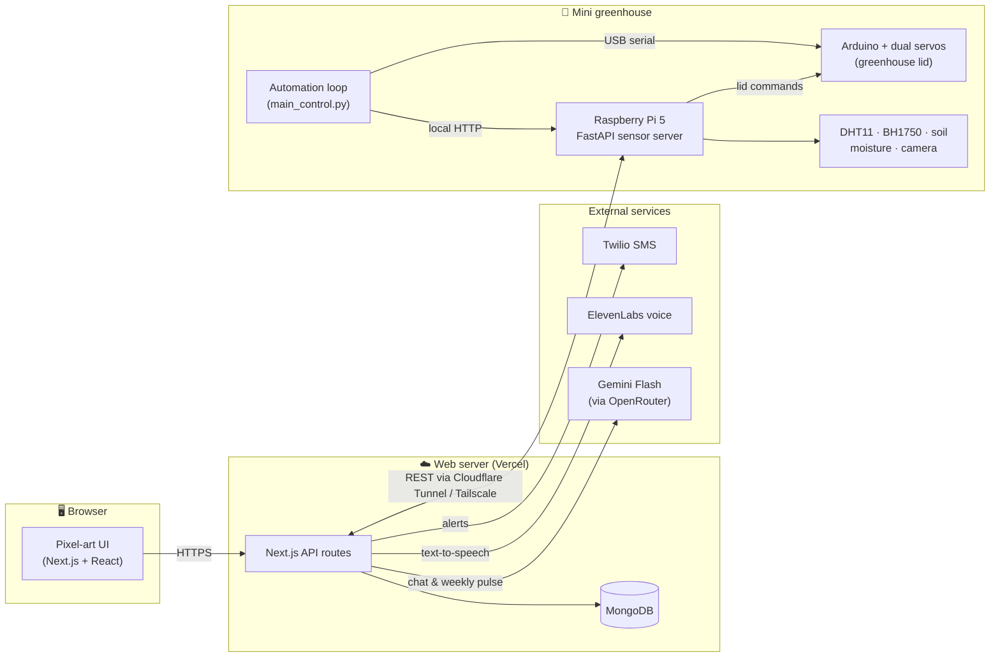

# Plante

$\small\textcolor{gray}{\textsf{We built Plante, a plant monitor, so you can touch grass inside}}$

Plante *(French for "plant")* pairs a real greenhouse, built on a Raspberry Pi and an Arduino, with a pixel-art web app where keeping plants alive earns you XP, achievements, and bragging rights.

> 🏆 **A double winner:** Plante took home the **Best Design** prize at uOttaHack 8, a hackathon with over 400 participants, and its writeup won the [Built with Google Gemini Writing Challenge](https://dev.to/challenges/mlh-built-with-google-gemini-02-25-26) on [dev.to](https://dev.to/)!

  

## 📖 The Story

Lots of people want to grow their own fruits and vegetables but simply don't have the time to monitor a garden. Plante was built to bridge that gap: an accessible Raspberry Pi kit that automates the boring parts of plant care, and a game-like app that makes the rest fun.

The project was built in 36 hours at [uOttaHack 8](https://devpost.com/software/plante), an MLH-sponsored hackathon with over 400 participants, where it won the **Best Design** prize. The story behind the build went on to win the [Built with Google Gemini Writing Challenge](https://dev.to/challenges/mlh-built-with-google-gemini-02-25-26) on dev.to, making Plante a winner twice over.

## 🎬 Demo

| Full hardware & software demo | Farm mini-game on CodePen |
|:---:|:---:|
|  |  |

- **Live app:** [plante-flame.vercel.app](https://plante-flame.vercel.app). Feel free to register! AI features were disabled after the hackathon ended.
- **Farm mini-game:** A [CodePen demo](https://codepen.io/zkttazgw-the-flexboxer/full/JoRYVRz) of the little farm game, written in TypeScript from scratch. Press `G` to express yourself!

## ✨ Features

- **🏡 Automated Greenhouse**: The physical box opens and closes its lid with servos to regulate temperature and humidity, based on configurable thresholds
- **📊 Live Sensor Data**: Real-time temperature, humidity, light, and soil moisture readings streamed from the Raspberry Pi
- **📸 Plant Camera**: A Pi camera keeps an eye on the plant's health, with pixel-art filters to match the vibe
- **🤖 Context-Aware AI Chat**: Not a generic botany bot. Real-time sensor data from your farms is passed into the prompt, so asking *"Help, my Tomato Farm is critical 😭"* gets advice based on that farm's actual readings. Powered by Gemini Flash, with ElevenLabs voice replies
- **📈 Weekly Pulse**: AI-generated weekly reports that analyze the week's sensor data and suggest long-term habits
- **🎮 Gamification**: Earn XP, keep up "green streaks", and unlock achievements in your personal museum for keeping plants alive
- **🧑‍🤝‍🧑 Social Farming**: Visit your friends' farms and museums, climb the leaderboard, and emote at each other
- **🔔 Smart Notifications**: In-app alerts and SMS via Twilio when a farm needs attention
- **🔐 Google Auth**: Secure sign-in with NextAuth.js

| Context-aware chat | Weekly Pulse |
|:---:|:---:|
|  |  |

## 🏗️ Architecture

Hooking physical hardware up to a web application is no joke. An early approach of reading sensors directly from the app's backend caused deadlocks, so the design moved to a dedicated sensor service on the Pi that *owns* the hardware, with everything else talking to it over REST:

How the pieces talk to each other:

1. **On the Pi**, a FastAPI server reads the sensors and camera, caches readings, and exposes them as REST endpoints (`/sensors`, `/camera`, `/lid`). It runs as a systemd service and is the only process that touches the GPIO pins.
2. **An automation loop** on the Pi polls that same API, compares readings against per-plant thresholds, and tells the Arduino over USB serial to open or close the greenhouse lid with its two servos.
3. **The Next.js server** reaches the Pi through a Cloudflare Tunnel (or Tailscale VPN), syncs sensor snapshots into MongoDB, and computes each farm's `healthy` / `warning` / `critical` status.
4. **The AI features** build their prompts from this live data. The chat assistant and Weekly Pulse both know exactly what temperature, humidity, and soil moisture each farm is sitting at.

## 🌡️ Hardware

| Component | Role |
|-----------|------|
| Raspberry Pi 5 | Runs the sensor API and automation loop |
| Arduino + 2 servos | Opens and closes the greenhouse lid |
| DHT11 | Temperature & humidity |
| BH1750 | Light intensity |
| Soil moisture sensor | Via a Waveshare AD/DA HAT (analog → digital) |
| Camera Module 3 | Plant photos & health monitoring |

See [`hardware/README.md`](hardware/README.md) for wiring diagrams, pin assignments, and sensor testing, and [`hardware/NETWORKING.md`](hardware/NETWORKING.md) for exposing the Pi to the web server.

> Fun fact: the original plan included an automated water pump, but the hackathon kit couldn't draw enough power to run it. The "Water Now" button was rewired to send notifications instead, a crash course in MVP scoping when hardware refuses to cooperate.

## 🛠️ Tech Stack

| Category | Technology |
|----------|------------|
| Framework | Next.js 16, React 19, TypeScript |
| Styling | Tailwind CSS, NES.css, PICO-8 palette, Framer Motion |
| Database | MongoDB with NextAuth adapter |
| Auth | NextAuth.js (Google OAuth) |
| AI | Gemini Flash via OpenRouter |
| Voice | ElevenLabs TTS |
| SMS | Twilio |
| Hardware API | Python, FastAPI, systemd |
| Monitoring | Sentry |

## 🚀 Getting Started

The app now runs as a fully self-contained demo: no environment variables, API keys, or database needed. Just `npm install` and `npm run dev`, then sign in with the demo account.

Setup instructions for the web app and the Raspberry Pi, the project structure, development commands, and links to all feature docs live in [`docs/GETTING_STARTED.md`](docs/GETTING_STARTED.md).
